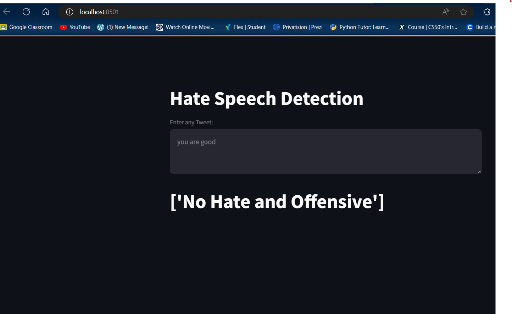

# Hate Speech Detection App

## Executive Summary

The **Hate Speech Detection App** is a web application designed to identify and classify text input as hate speech, offensive language, or neutral content. Built with **Streamlit**, it provides an interactive user interface for real-time analysis. The app leverages a fine-tuned Transformer model from the **Hugging Face Transformers** library, utilizing advanced natural language processing (NLP) techniques to deliver accurate and efficient predictions. The project showcases the integration of modern machine learning models into a user-friendly application, highlighting the practical application of NLP in combating hate speech online.

## Detailed Description

### Overview

- **Objective**: To detect hate speech and offensive language in user-provided text inputs.
- **Approach**: Use a fine-tuned Transformer model for text classification.
- **User Interface**: Streamlit-based web app with dynamic styling and interactive elements.

### Techniques and Libraries Used

#### 1. Python

- The primary programming language used for development.
- Offers extensive libraries and frameworks for machine learning and web development.

#### 2. Streamlit

- **Purpose**: Simplifies the creation of web applications for machine learning and data science projects.

#### 3. Hugging Face Transformers

- **Transformers Library**: Provides pre-trained models for NLP tasks.
- **Classes Used**:
  - AutoTokenizer: Tokenizes input text suitable for the model.
  - AutoModelForSequenceClassification: Loads the pre-trained and fine-tuned model for classification tasks.

- **Model Fine-Tuning**:
  - The model is fine-tuned on a labeled dataset specific to hate speech detection.
  - Adjusts the pre-trained model parameters to improve performance on this task.

#### 4. PyTorch

- **Purpose**: An open-source machine learning library used for developing and training neural network models.
- **Usage**:
  - Handles tensor computations and model loading.
  - Provides utilities like torch.no_grad() for inference without tracking gradients.
  - torch.nn.functional.softmax: Used to convert model outputs (logits) into probabilities.

#### 5. Natural Language Processing Techniques

- **Text Preprocessing**:
  - Cleaning text data by removing special characters, numbers, and extra spaces.
  - Converting text to lowercase.
- **Tokenization**:
  - Breaking down text into tokens that can be understood by the model.
- **Classification**:
  - Assigning input texts to predefined categories based on learned patterns.

#### 6. Regular Expressions (`re` module)

- Used in `rejoin.py` to match file patterns and reassemble split model files.

#### 7. OS Module

- Interacts with the operating system for file operations like checking file existence and directory traversal.

#### 8. Screenshot:


### Code Description #### 

`app.py`
- **Purpose**: The main application script that runs the Streamlit app.
- **Key Components**:
  - **Imports**: Incorporates necessary libraries and modules.
    ```python
    import streamlit as st
    import torch
    from transformers import AutoTokenizer, AutoModelForSequenceClassification
    import os
    from src.preprocess import preprocess_text
    from rejoin import reassemble_files
    ```
  - **Page Configuration**: Sets up the app's page settings.
    ```python
    st.set_page_config(page_title="Hate Speech Detection", page_icon="📝", layout="wide")
    ```
  - **Model Loading Function** (load_or_train_model):
    - Caches the function to prevent unnecessary reloads.
    - Reassembles model files using reassemble_files.
    - Loads the tokenizer and model from the fine-tuned model directory.
    ```python
    @st.cache_resource
    def load_or_train_model():
        model_dirs = ['./fine_tuned_model', './results/checkpoint-4957']
        for directory in model_dirs:
            reassemble_files(directory)
        tokenizer = AutoTokenizer.from_pretrained('./fine_tuned_model')
        model = AutoModelForSequenceClassification.from_pretrained(
            './fine_tuned_model',
            ignore_mismatched_sizes=True
        )
        return tokenizer, model
    ```
  - **Model Loading**:
    - Retrieves the tokenizer and model.
    - Sets the model to evaluation mode with `model.eval()`.
  - **Labels Dictionary**:
    - Maps numerical prediction outputs to human-readable labels.
    ```python
    labels = {0: "Hate Speech", 1: "Offensive Language", 2: "No Hate and Offensive"}
    ```
  - **Dynamic Background Color**:
    - Uses st.session_state to store and update the background color based on prediction.
    - Default color is set to white.
    ```python
    if 'bg_color' not in st.session_state:
        st.session_state['bg_color'] = '#ffffff'  # Default white background
    bg_color = st.session_state['bg_color']
    ```
  - **Custom CSS Styling**:
    - Implements styling for the app, including the background color, button styles, and layout adjustments.
    ```python
    st.markdown(f"""
        <style>
        /* CSS styles using {bg_color} */
        </style>
        """, unsafe_allow_html=True)
    ```
  - **Main Interface**:
    - **Title and Header**: Displays the app title and introduction.
    - **Text Input**: Provides a text area for users to input text.
    - **Prediction Button**: A button that triggers the hate speech detection process.
    - **Prediction Logic**:
      - Preprocesses the input text.
      - Tokenizes the text.
      - Performs inference using the model.
      - Calculates prediction probabilities.
      - Updates the background color based on the result.
      - Displays the prediction and confidence score.
      - Shows a bar chart of classification probabilities.
    - **Footer**: Contains contact information with links to GitHub and LinkedIn profiles.

####  `rejoin.py`
- **Purpose**: Handles reassembling of split model files that are too large to be stored as a single file.
- **Function (reassemble_files)**:
  - Scans the specified directory for files matching the pattern of split files (e.g., `filename.part1`, `filename.part2`).
  - Sorts and combines these parts into the original file.
  - Checks if the combined file size exceeds a minimum size before reassembling.
  ```python
  import os
  import re

  def reassemble_files(directory, min_size=3 * 1024 * 1024):
      # Implementation details
  ```

#### `preprocess.py`
- **Purpose**: Contains text preprocessing functions necessary for cleaning the input text before prediction.
- **Function (preprocess_text)**:
  - Converts text to lowercase.
  - Removes unwanted characters and extra whitespace.
  - Prepares text for tokenization and model input.
  ```python
  import re

  def preprocess_text(text):
      # Implementation details
  ```

### Important Files

- **`app.py`**:
  - The core Streamlit application script.
  - Integrates all components: model loading, user interface, prediction logic, and dynamic styling.

- **`rejoin.py`**:
  - Ensures that any split model files are correctly reassembled for the model to function.
  - Critical for handling large model files that cannot be stored or transferred as a single file.

- **`src/preprocess.py`**:
  - Centralizes text preprocessing steps.
  - Improves code maintainability and reusability.

- **`requirements.txt`**:
  - Lists all Python dependencies required to run the application.
  - Ensures consistent environment setup for anyone running the app.

- **`fine_tuned_model Directory`**:
  - Contains the pre-trained and fine-tuned model files necessary for predictions.
  - Includes configuration files like `config.json`, tokenizer files like `tokenizer.json` and `vocab.txt`, and model weights.

### Model Fine-Tuning and Prediction Process

- **Dataset Preparation**:
  - Collected and labeled data containing examples of hate speech, offensive language, and neutral content.
  - Ensured diversity and balance in the dataset for robust learning.

- **Fine-Tuning Steps**:
  - Started with a pre-trained Transformer model.
  - Used transfer learning to adapt the model to the specific task of hate speech detection.
  - Employed techniques like learning rate scheduling and regularization to prevent overfitting.

- **Prediction Workflow**:
  1. **Input Reception**: User inputs text through the app interface.
  2. **Preprocessing**: Text is cleaned and prepared for the model.
  3. **Tokenization**: Text is tokenized into a format suitable for the Transformer model.
  4. **Model Inference**: The model processes the input and outputs raw scores (logits) for each class.
  5. **Probability Calculation**: Softmax function is applied to logits to obtain probabilities.
  6. **Prediction Determination**: The class with the highest probability is selected as the predicted label.
  7. **Result Display**: Prediction and confidence are displayed to the user; UI updates (background color) are applied.

### UI/UX Enhancements

- **Dynamic Background Color**:
  - Provides immediate visual feedback based on the prediction.
  - Red background for hate speech or offensive language.
  - Green background for neutral content.

- **Custom CSS Styling**:
  - Enhances the visual appeal of the app.
  - Styles buttons, text areas, headers, and footers.
  - Ensures the app is user-friendly and accessible.

- **Interactive Elements**:
  - **Spinner**: Indicates processing when making predictions.
  - **Bar Chart**: Visualizes the probabilities for each class, providing insight into the model's confidence.

- **Responsive Layout**:
  - The app adjusts to different screen sizes.
  - Content is centered and has maximum width constraints for readability.

## Contact Information

Developed by **Rayyan Ahmed**

- **GitHub**: [Rayyan9477](https://github.com/Rayyan9477)
- **LinkedIn**: [Rayyan Ahmed](https://www.linkedin.com/in/rayyan-ahmed9477/)
- **Email**: [rayyanahmed265@yahoo.com](mailto:rayyanahmed265@yahoo.com)

---
